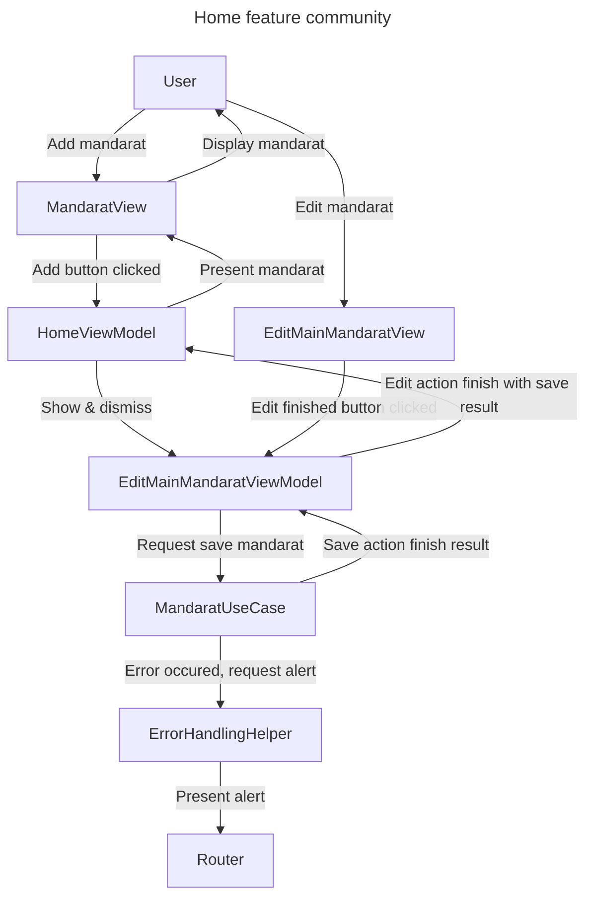

# Home feature object community

```mermaid
---
title: Home feature community
---
flowchart
    User -->|Add mandarat| MandaratView 
    MandaratView -->|Display mandarat| User
    MandaratView -->|Add button clicked| HomeViewModel
    HomeViewModel -->|Show & dismiss| EditMainMandaratViewModel
    User -->|Edit mandarat| EditMainMandaratView 
    EditMainMandaratView -->|Edit finished button clicked| EditMainMandaratViewModel
    EditMainMandaratViewModel --> |Request save mandarat| MandaratUseCase
    MandaratUseCase --> |Save action finish result| EditMainMandaratViewModel
    MandaratUseCase --> |Error occured, request alert| ErrorHandlingHelper
    ErrorHandlingHelper --> |Present alert| Router
    EditMainMandaratViewModel --> |Edit action finish with save result| HomeViewModel
    HomeViewModel --> |Present mandarat| MandaratView

```