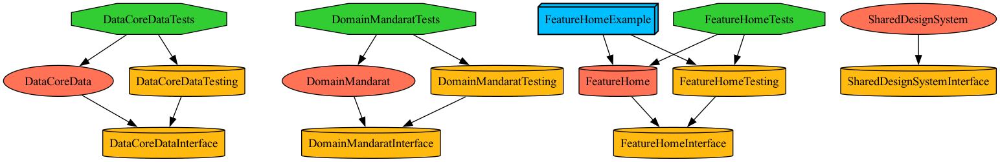
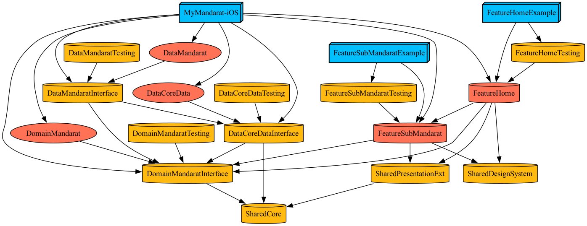

# MyMandalart

만다라트 작성을 도와주는 iOS어플리케이션 입니다.

# Tech features

<table>
    <tr>
        <td>
            <b>메인 프레임워크</b>
        </td>
        <td>
            <b>UIKit</b>
        </td>
    </tr>
    <tr>
        <td>
            <b>아키텍처</b>
        </td>
        <td>
            <b>클린아키텍처</b>
        </td>
    </tr>
    <tr>
        <td>
            <b>디자인 패턴</b>
        </td>
        <td>
            <b>RIBs(+MVVM), 단방향플로우(with ReactorKit)</b>
        </td>
    </tr>
    <tr>
        <td>
            <b>외부 의존성</b>
        </td>
        <td>
            <b>RxSwift, RxCocoa, ReactorKit, SnapKit</b>
        </td>
    </tr>
</table>

## 모듈타입별 의존성 구조

**Feature모듈**의 경우 [TMA(The modular architecture)](https://docs.tuist.dev/en/guides/develop/projects/tma-architecture#the-modular-architecture-tma)를 적용하여 구체타입과 인터페이스를 구분하고, 예시앱을 통한 구동테스트 및 단위 테스트코드 작성을 쉽게 처리할 수 있도록 했습니다.



### 프로젝트 전체 모듈구조

※ TMA구조를 준수하려고 하였으나, Feature모듈에 포함되는 **interface**타겟은 해당 프로젝트에 불필요하다고 판단하여 제거했습니다.



## Builder와 Router를 사용한 모듈화

Feature모듈의 타겟은 RIBs 라이브러리의 형태를 채용했습니다. 


각각의 Feature들은 RIBs의 RIB과 같은 단위로 묶이게 되고 Builder를 참조함으로써 다른 모듈과 소통합니다.

※ RIBs 라이브러리를 사용하지 않아, 해당 글에서는 RIB을 모듈이라고 표현하겠습니다.

해당 프로젝트의 모듈 관계는 아래와 같습니다.


각가의 모듈은 서로다른 타겟으로 분리되어 있으며 인터페이스를 통해서 서로 소통합니다.

아래 디렉토리 구조는 Feature모듈의 구현체가 포함되어 있는 타겟의 디렉토리 구조입니다.

외부로 노출되는 `public interface`와 `내부 구현사항`을 분리하여 변경이 발생하지 않은 모둘이 재빌되는 것을 막았습니다. (낮은 결합도 높은 응집도 확보)

```
├── 🔔 Interface
│   ├── MainMandaratBuildable.swift
│   ├── MainMandaratDependency.swift
│   ├── MainMandaratPageViewControllable.swift
│   ├── MainMandaratPageViewModelable.swift
│   └── MainMandaratRoutable.swift
│
├── MainMandaratBuilder.swift
├── MainMandaratComponent.swift
├── MainMandaratRouter.swift
├── Model
│   └── ...
├── View
│   └── ...
└── ViewModel
    └── ...
```

## 유닛테스트

### 단방향 플로우를 활용한 테스트코드 작성

ReactorKit을 사용하여 View와 ViewModel의 상호작용에서 단방향성을 확보했습니다.

단방향성의 장점인, **특정 상태와 + 특정 액션이 만들어내는 새로운 상태를 추적하기 용이**하다는 점을 사용하여 ViewModel의 테스트코드를 작성하였습니다.

아래코는 유저가 저장 액션을 실행할 시 인풋을 검증하는 코드를 테스트하는 코드입니다. 잘못된 인풋에 대해 Alert를 표출할 수 있는 데이터를 만들어냄을 확인할 수 있습니다.

```swift
struct EditMainMandaratViewModelTest {
    
    @Test
    func saveValidation() {
        
        let editViewModel = EditMainMandaratViewModel(.createEmpty(with: .ONE_ONE))
        
        let testState: EditMainMandaratViewModel.State = .init(
            titleText: "",
            descriptionText: "",
            mandaratTitleColor: .white
        )
        
        // 타이틀 문자열이 비어있는 상태에서 세이브 버튼 클릭
        let resultState = editViewModel.reduce(state: testState, mutation: .saveButtonClicked)
        
        #expect(resultState.alertData != nil)
    }
}
```
※ 모든 테스트코드 작성은 XCTest프레임워크가 아닌 Testing프레임워크를 사용해 작성했습니다.

### Testing타겟을 사용하여 앱내 로직만을 테스트

각각의 모듈들은 **Testing**타겟을 가집니다. 해당 타겟의 역할은 유닛 테스트 및 예시앱 테스트에서 오직 앱내 로직만을 테스트하기 위해 사용됩니다.

예를들어 ViewModel이 의존하는 Domain, Data레이어의 클래스의 경우 앱외 로직을 포함할 수 있습니다. 따라서 아래와 같이 **Mock객체를 Testing모듈이 포함하고 테스트시 사용**합니다.

```swift
import DomainUserStateInterface

public class MockUserStateUseCase: UserStateUseCase {
    
    private var memoryDict: [String: Any] = [:]
    
    public init() {
        
        BooleanUserStateKey.allCases.forEach { key in
            
            memoryDict[key.rawValue] = key.initialValue
        }
...

// Testing모듈을 사용하는 Example앱 코드의 일부입니다.

let component: RootComponent = .init(
    mandaratUseCase: MockMandaratUseCase(),
    navigationController: navigationController,
    userStateUseCase: MockUserStateUseCase()
)

let router = MainMandaratBuilder(dependency: component).build()

```
