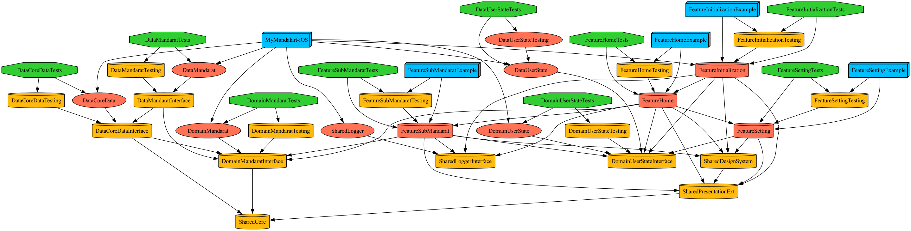

# MyMandalart

만다라트 작성을 도와주는 iOS어플리케이션 입니다.

# Tech features

<table>
    <tr>
        <td>
            <b>메인 프레임워크</b>
        </td>
        <td>
            <b>UIKit</b>
        </td>
    </tr>
    <tr>
        <td>
            <b>아키텍처</b>
        </td>
        <td>
            <b>클린아키텍처</b>
        </td>
    </tr>
    <tr>
        <td>
            <b>디자인 패턴</b>
        </td>
        <td>
            <b>RIBs(+MVVM), 단방향플로우(with ReactorKit)</b>
        </td>
    </tr>
    <tr>
        <td>
            <b>외부 의존성</b>
        </td>
        <td>
            <b>RxSwift, RxCocoa, ReactorKit, SnapKit</b>
        </td>
    </tr>
</table>

## 모듈타입별 의존성 구조

**Feature모듈**의 경우 [TMA(The modular architecture)](https://docs.tuist.dev/en/guides/develop/projects/tma-architecture#the-modular-architecture-tma)를 적용하여 구체타입과 인터페이스를 구분하고, 예시앱을 통한 구동테스트 및 단위 테스트코드 작성을 쉽게 처리할 수 있도록 했습니다.


### 프로젝트 전체 모듈구조

※ TMA구조를 준수하려고 하였으나, Feature모듈에 포함되는 **interface**타겟은 해당 프로젝트에 불필요하다고 판단하여 제거했습니다.



## Builder와 Router를 사용한 모듈화

Feature모듈의 타겟은 RIBs 라이브러리의 형태를 채용했습니다. 

// 구조 빌드 이미지

각각의 Feature들은 RIBs의 RIB과 같은 단위로 묶이게 되고 Builder를 참조함으로써 다른 모듈과 소통합니다.

※ RIBs 라이브러리를 사용하지 않아, 해당 글에서는 RIB을 모듈이라고 표현하겠습니다.

해당 프로젝트의 모듈 관계는 아래와 같습니다.

// 모듈 관계 이미지

각가의 모듈은 서로다른 타겟으로 분리되어 있으며 인터페이스를 통해서 서로 소통합니다.

아래 디렉토리는 Feature모듈의 구현체가 포함되어 있는 타겟의 디렉토리 구조입니다.

외부로 노출되는 `public interface`와 `내부 구현사항`을 분리하여 변경이 발생하지 않은 모둘이 재빌되는 것을 막았습니다.

```
├── 🔔 Interface
│   ├── MainMandaratBuildable.swift
│   ├── MainMandaratDependency.swift
│   ├── MainMandaratPageViewControllable.swift
│   ├── MainMandaratPageViewModelable.swift
│   └── MainMandaratRoutable.swift
│
├── MainMandaratBuilder.swift
├── MainMandaratComponent.swift
├── MainMandaratRouter.swift
├── Model
│   └── ...
├── View
│   └── ...
└── ViewModel
    └── ...
```